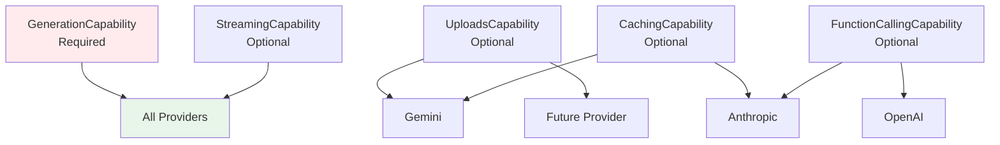

# Provider Capabilities Model — Conceptual Overview

> Status: Implemented. This model governs how provider differences are abstracted.
>
> Audience: Contributors implementing new provider adapters.
> Prerequisites: Understanding of Python protocols and the API Execution pattern.

## Purpose & Scope

The Provider Capabilities Model defines how the pipeline abstracts over different LLM providers (Gemini, OpenAI, Anthropic) while maintaining type safety and explicit feature detection.

**In scope**:

- Capability protocol definitions
- Runtime capability checking
- Graceful degradation patterns
- Provider adapter structure

**Not in scope**:

- Specific provider API details
- Authentication/configuration
- Rate limiting strategies
- Pricing/quota management

---

## Design Forces

Different providers offer different features:

- **Gemini**: Generation + File uploads + Context caching
- **OpenAI**: Generation + Function calling (no native caching)
- **Anthropic**: Generation + Some caching (no file uploads)

Traditional approaches use:

- **Lowest common denominator**: Only features all providers support
- **Provider-specific branches**: If-else chains throughout code
- **Abstract base classes**: Complex inheritance hierarchies

We need:

- **Progressive enhancement**: Use features when available
- **Type safety**: Compile-time verification of capability usage
- **Runtime detection**: Graceful handling of missing features
- **Clear contracts**: Explicit about what each provider offers

---

## Core Concepts

### Capability Protocols

Fine-grained protocols define specific provider abilities:

```python
@runtime_checkable
class GenerationCapability(Protocol):
    """Core capability - all providers must have this."""
    async def generate(...) -> dict: ...

@runtime_checkable
class UploadsCapability(Protocol):
    """Optional - for providers supporting file uploads."""
    async def upload_file(...) -> FileRefPart: ...
```

### Capability Checking

Two levels of verification:

1. **Type-time**: Protocol inheritance
2. **Runtime**: `isinstance()` checks via `@runtime_checkable`

### Adapter Pattern

Each provider has an adapter that:

- Implements relevant capability protocols
- Translates between neutral and provider types
- Handles provider-specific errors
- Normalizes responses

---

## Capability Hierarchy



---

## Usage Patterns

### Required Capability

```python
# Generation is required - checked at construction
if not isinstance(provider, GenerationCapability):
    raise ValueError("Provider must support generation")
```

### Optional Capability

```python
# Uploads optional - check and degrade gracefully
if isinstance(provider, UploadsCapability):
    file_ref = await provider.upload_file(path)
else:
    # Use inline content or skip
    pass
```

### Conditional Execution

```python
# Stage only runs if capability present
class UploadStage:
    def applies_to(self, state, provider):
        return bool(state.plan.upload_tasks) and
               isinstance(provider, UploadsCapability)
```

---

## Benefits

### Type Safety

- Can't call upload on provider without UploadsCapability
- IDE autocomplete shows available methods
- Type checker catches capability misuse

### Progressive Enhancement

- Use best features when available
- Degrade gracefully when not
- No artificial limitations

### Clear Contracts

- Providers explicitly declare capabilities
- Users know what's available
- No hidden assumptions

### Testing

- Mock adapters can selectively implement capabilities
- Test graceful degradation paths
- Verify capability detection logic

---

## Anti-Patterns to Avoid

### ❌ Capability Assumption

```python
# Bad: Assumes all providers have upload
file_ref = await provider.upload_file(...)  # May not exist!
```

### ❌ Provider Name Checking

```python
# Bad: Brittle string checking
if "gemini" in provider_name.lower():
    # Use Gemini features
```

### ❌ Kitchen Sink Interface

```python
# Bad: One interface with everything optional
class Provider:
    async def generate(...)  # Required? Optional?
    async def upload(...)    # Raises NotImplementedError?
    async def cache(...)     # Returns None?
```

### ✅ Correct Pattern

```python
# Good: Explicit capability checking
if isinstance(provider, UploadsCapability):
    file_ref = await provider.upload_file(...)
else:
    # Explicit alternative path
    logger.info("Provider doesn't support uploads, using inline")
```

---

## Adding New Capabilities

1. Define protocol in `capabilities/new_capability.py`
2. Mark with `@runtime_checkable`
3. Implement in relevant adapters
4. Add conditional usage in stages
5. Document degradation behavior
6. Add capability tests

---

## Related Documents

- [Concept — API Execution Pattern](./api-execution.md)
- [Deep Dive — API Handler Spec](../deep-dives/api-handler-spec.md)
- [How-to — Adding Provider Adapters](../../how-to/provider-adapters.md)
